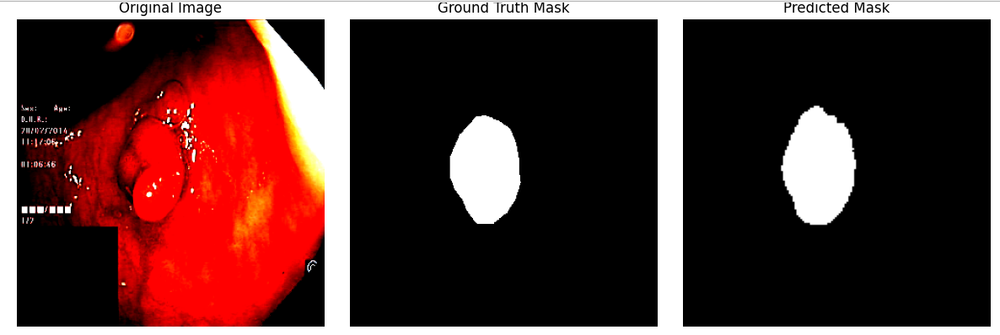

# Hydra-MONAI-Lightning-FlexibleUNet-ColonPolypSegmentation
The polyp segmentation for colonoscopy project uses MONAI’s Flexible UNet with PyTorch Lightning and Hydra for streamlined training and configuration.


<br>

## Table of Contents

- [Installation](#installation)
- [Usage](#usage)
- [Dataset Information](#dataset-information)
- [Training/Inference code and Performance visualisation](#traininginference-code-and-performance-visualisation)
- [About the Model](#about-the-model)
- [Performance Metrices](#performance-metrics)

<br>

## Installation

To run this project, you need to have Python installed. We recommend using a virtual environment to manage dependencies.

1. **Clone the repository**:
    ```sh
    git clone <repository-url>
    cd <repository-folder>
    ```

2. **Create a virtual environment**:
    ```sh
    python -m venv env
    source env/bin/activate  # On Windows, use `env\Scripts\activate`
    ```

3. **Install dependencies**:
    ```sh
    pip install -r requirements.txt
    ```

<br>

## Usage

1.  **Run main.py in the following manner to train and test the model normally**:
    ```sh
    python3 train.py 
    ```
2. **Run main.py in the following manner to train the model by tuning hyperparameters using wanb sweep**:
    ```sh
    wandb sweep.yaml sweep
    ```
3. **Project Structure:**

```
project/
├── config/
│   ├── config.yaml
│   ├── data/
│   │   └── data.yaml
│   ├── model/
│   │   └── unet.yaml
│   ├── training/
│   │   └── training.yaml
│   ├── callbacks/
│   │   └── callbacks.yaml
│   ├── transforms/
│   │   └── transforms.yaml
├── train.py
├── model.py
├── dataset.py
├── custom_dataset.py
├── transform.py
├── plot.py
└── sweep.yaml
```

   
3. The following are the files and their purpose :
   
| File / Directory    | Description                                                                                                           |
| ------------------- | --------------------------------------------------------------------------------------------------------------------- |
| `train.py`          | Main training entry point using PyTorch Lightning, MONAI, and Hydra; supports both normal and W\&B sweep modes.       |
| `sweep.py`          | Script to launch and manage W\&B hyperparameter sweeps, integrating Hydra configs for parameter injection.            |
| `model.py`          | Contains the `SegmentationModel` class built with MONAI's `FlexibleUNet` and LightningModule for training/evaluation. |
| `dataset.py`        | Defines `SegmentationDataModule` to handle dataset loading, splitting, and batching using MONAI Dataset API.          |
| `custom_dataset.py` | A custom MONAI-compatible dataset class to load image-mask pairs with optional transforms.                            |
| `plot.py`           | Visualization utility to display input images, ground truth masks, and model predictions side by side.                |


| Config File                         | Description                                                                                                             |
| ----------------------------------- | ----------------------------------------------------------------------------------------------------------------------- |
| `sweep.yaml`                        | W\&B sweep configuration that defines hyperparameter ranges, optimization method, and launch commands.                  |
| `config/config.yaml`                | Root Hydra config with default references and global settings (debug flags, output paths, W\&B options).                |
| `config/data/data.yaml`             | Specifies data-related parameters like paths, batch size, number of workers, and image preprocessing.                   |
| `config/model/unet.yaml`            | Model definition using MONAI FlexibleUNet with architecture parameters, loss, and metrics setup.                        |
| `config/training/training.yaml`     | Training setup including optimizer, scheduler, early stopping, checkpointing, and Lightning trainer settings.           |
| `config/callbacks/callbacks.yaml`   | Defines PyTorch Lightning callbacks such as `ModelCheckpoint` and `EarlyStopping` with monitoring metrics and settings. |
| `config/transforms/transforms.yaml` | Specifies image augmentation and preprocessing transforms for training and validation datasets.                         |


<br>

## Dataset Information
The model used in this project is trained on 'Kvasir-SEG Dataset'. The dataset contains 1000 polyp images and their corresponding ground truth from the Kvasir Dataset v2. The images and its corresponding masks are stored in two separate folders with the same filename. 

- **Source** : [Kvasir SEG Dataset](https://datasets.simula.no/kvasir-seg/)
- **Task** : Polyp Identification in colonoscopy imaged (Identify and mask the polyp from the image).
- **Data** : 1000 captcha polyp images with resolution varying from 332x487 to 1920x1072.
- **Masks** : The images and its corresponding masks are stored in two separate folders with the same filename.
- **Example** : The following are examples for the data image and mask. Not that the files are named the same though in seperate folders.
- 
- 

<br>

## Sweeping, Training and Testing


- WandB sweeps were done on the model to find out the best hyperparameters.
- The model was then trained with these hyperparameters and depending upon their performance additional adjustments were made.
- The model was then finally tested.
- Example prediction :
    -  

<br>

## About the Model
The project uses the `FlexibleUNet` model from `MOANI` for achieving polyp segmentation in colonoscopy images. The best hyperparamets for the model was chosen after running sweeps using wandb and running deliberations on the result. 
The final hyperparameters and other parameters used are :
- backbone : "efficientnet-b4"
- in_channels : 3
- out_channels : 1
- pre_trained : true
- decoder_channels : [256, 128, 64, 32, 16]
- spatial_dimensions : 2    
- batch_size : 2
- num_workers : 8
- optimizer : sgd
- learning_rate : 0.007398
- epochs : 10
- precision : 32

<br>
  
- `DiceLoss` from MONAI was used as the loss function and `DiceMetric` from MONAI was used as the metric
      
- On final testing, the model with the above paramters gave a performance score of 0.854 (Dice).
      


<br>

## Performance Metric
- Training : DiceLoss as loss function.
- Testing  : DiceMetric as evaluation metric.
